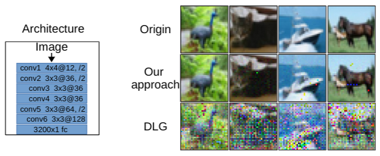

# R-GAP
> Paper accepted at ICLR 2021

Federated learning frameworks have been regarded as a promising approach to break the dilemma between demands on privacy and the promise of learning from large collections of distributed data. Many such frameworks only ask collaborators to share their local update of a common model, i.e. gradients with respect to locally stored data, instead of exposing their raw data to other collaborators. However, recent optimization-based gradient attacks show that raw data can often be accurately recovered from gradients. It has been shown that minimizing the Euclidean distance between true gradients and those calculated from estimated data is often effective in fully recovering private data. However, there is a fundamental lack of theoretical understanding of how and when gradients can lead to unique recovery of original data. Our research fills this gap by providing a closed-form recursive procedure to recover data from gradients in deep neural networks. We name it Recursive Gradient Attack on Privacy (R-GAP). Experimental results demonstrate that R-GAP  works as well as or even better than optimization-based 
approaches at a fraction of the computation under certain conditions as shown in the Figure 1. This repository demonstrates the attack of R-GAP.
<p align="center">
      
</p>
<p align="center">
    <em>Figure 1</em>
</p>

Additionally, we propose a Rank Analysis method, which can be used to estimate the risk of gradient attacks inherent in certain network architectures, regardless of whether an optimization-based or closed-form-recursive attack is used. Experimental results demonstrate the utility of the rank analysis towards improving the network's security. For more about this please refer to the paper.

## Download

```sh
git clone https://github.com/JunyiZhu-AI/R-GAP.git
cd R-GAP
python3 -m venv env
source env/bin/activate
pip install -r requirement.txt
```

## Usage example
> The result of reconstruction will be saved in visualization folder.

* Reconsturction of the 0-th image in CIFAR10 over the CNN6 architecture:
```
python main.py -i 0
```
Origin             |  Reconstructed|  Rescale reconstructed
:-------------------------:|:-------------------------:|:-------------------------:
  |  |  

* Reconsturction of a random image over the CNN6-d architecture:
```
python main.py -m CNN6-d
```
* Reconsturction of a mini batch over the FCN3 architecture:
```
python main.py -m FCN3 -d MNIST -b 5
```


## Citation
```
@inproceedings{
zhu2021rgap,
title={R-{\{}GAP{\}}: Recursive Gradient Attack on Privacy},
author={Junyi Zhu and Matthew B. Blaschko},
booktitle={International Conference on Learning Representations},
year={2021},
url={https://openreview.net/forum?id=RSU17UoKfJF}
}
```
