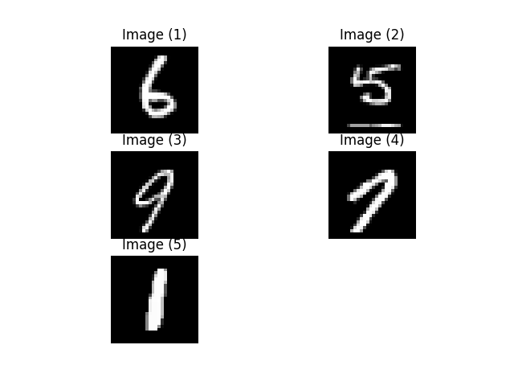
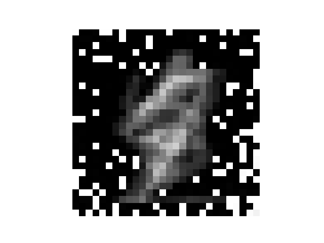
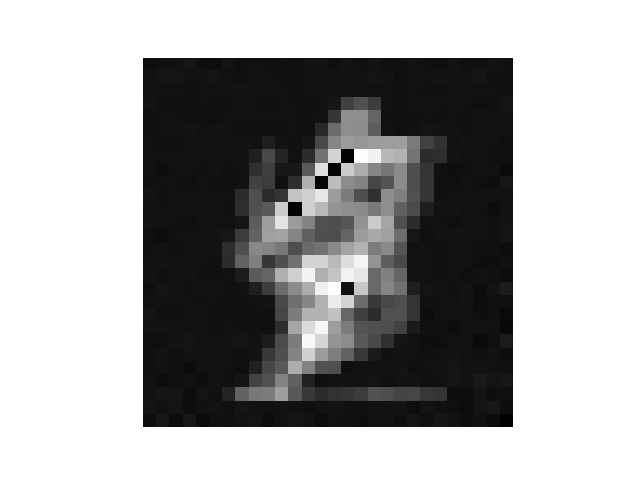

# R-GAP
> Recursive Gradient Attack on Privacy.

A closed-form approach performs the reconstruction of a raw data using the gradient which could be shared among collaborators in the federated learning.


## Download

```sh
git clone https://github.com/JunyiZhu-AI/R-GAP.git
cd R-GAP
python3 -m venv env
source env/bin/activate
pip install -r requirement.txt
```

## Usage example
> The result of reconstruction will be saved in visualization folder.

* Reconsturction of the 3-th image in CIFAR10 over the CNN6 architecture:
```
python main.py -i 3
```
Origin             |  Reconstructed|  Rescale reconstructed
:-------------------------:|:-------------------------:|:-------------------------:
  |  |  

* Reconsturction of a random image over the CNN6-d architecture:
```
python main.py -m CNN6-d
```
* Reconsturction of a mini batch over the FCN3 architecture:
```
python main.py -m FCN3 -d MNIST -b 5
```


## Citation
```
@inproceedings{
anonymous2021rgap,
title={R-{\{}GAP{\}}: Recursive Gradient Attack on Privacy},
author={Anonymous},
booktitle={Submitted to International Conference on Learning Representations},
year={2021},
url={https://openreview.net/forum?id=RSU17UoKfJF},
note={under review}
}
```
